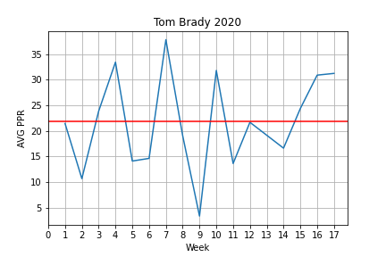

# Predicting Fantasy Football Points

Author: Kelly Mullaney

## Overview

**
## Business Problem
#### How do you accurately predict fantasy football points?
Every weekend, millions of Americans play Fantasy Football. So what is Fantasy Football? It's where participants serve as a virtual owner of 
a sports team. They draft players, and are awarded points each week based on those players real life statistics. They do this for a variety 
of reasons, but it usually results in cash prizes for the person with the highest score. The weekly payouts for daily fantasy football are 
in the tens of millions.

***
## Data
### Data Understanding
There is a very simple formula called PPR, that takes in the number of yards, catches, Touchdowns, etc. that a player has in a given game, 
and awards them points. The notebook pulls the data from Sports-Reference.com for individual players and defenses. The data provided only 
has the statistical results of a player's performance along with the rank of the defenses they are playing against. There are a number of 
factors that cause fluctuations in the scoring of individual players, such as;
- Recent Performances
- Opponent
- Coaching
- Individual Match Ups
- Injuries
- Playoff Positioning
- Weather and more

### Data Exploration
Since the goal is to make a predictive model and eventually a neural network. The data will need to be cleaned so that the model can intake 
the various features. Their is an "Individual Stats Scraping Notebook" where the user can customize the Sports-Reference link in order to 
pull more in depth data about a player, instead of just their points. For this project, we used Tom Brady as an example due to the fact 
that there is a large amout of data available on him.

Looking at the 2020 data for his week to week to performances, you can see there is a large amount of variation. Tom Brady is considered a 
very consistent player in the NFL so you can see how this makes it hard to correctly predict a players points in any given week.

## Models
### Player Models

For the player models we first did a baseline model, then a few different regressions before deciding to use XGBoost.

Our XGBoost model accuracy ranges from 17 - 73% depending on the player.

The accuracy of the train data is much higher than the test data, meaning it is overfit. This is hard to avoid given the inbalance of the 
data available for each player.

### Position Models
When we try to predict the accuracy of the QB Position as a whole, the results are much better. This is because while there are lots of 
fluctuations for indidvidual players week to week, the position as a whole consistently scores similar aggregate point totals each week.

Our XGBoost model accuracy for the position model was 77%.

## Conclusion

It is very difficult to accurately predict points consistently due to the amount of randomness/variattion in each game. This is why even 
professional organizations like FanDuel can still be way off in their predictions, and most often use something close to the mean for a 
player.

In order to make a more accurate model, you would need to incorporate a ton of other features such as weather, match ups, injuries, etc. and 
that still doesn't guarantee an accurate prediction.

As I work to improve the model, I want to train a neural network on the players recent games, and train another neural network on the 
defenses recent performances, and then comine the two into a singual neural network.

